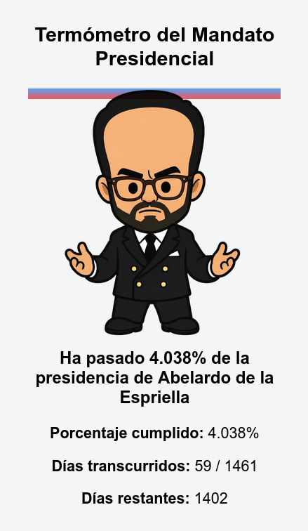

# 🌡️ Abelardómetro — Termómetro del Mandato Presidencial (2026–2030)

Un pequeño y cuqui termómetro interactivo que muestra el avance del mandato presidencial de Abelardo de la Espriella (Colombia, 7 de agosto de 2026 → 7 de agosto de 2030).  
La silueta se va “llenando” desde arriba hacia abajo según el porcentaje de días transcurridos del periodo presidencial.

Este proyecto nació como un experimento divertido, visual y amateur, pero con cariño.

---

## 🖼️ Vista previa

*(Reemplaza esta imagen cuando tengas una captura real)*

---

## ✨ Características

- Cálculo automático de:
  - Porcentaje del mandato cumplido  
  - Días transcurridos  
  - Días restantes  
- Relleno animado de la silueta  
- Degradado azul → rojo  
- Línea visible incluso en porcentajes microscópicos (como el 0.137% inicial)  
- Texto dinámico:  
  **“Ha pasado XX% de la presidencia de Abelardo de la Espriella”**

---

## 🧠 ¿Cómo funciona?

El widget calcula la diferencia entre la fecha de inicio del mandato (7 ago 2026) y la fecha actual del navegador.  
Luego determina el porcentaje del periodo presidencial transcurrido y ajusta la altura del relleno sobre la silueta.

El archivo principal es:

